# **project1**
## credit to : 《A File is Not a File: Understanding the I/O Behavior of Apple Desktop Applications》

**测试目的/目标**
- 使用strace追踪open office4 presentation这一软件当中制作一个ppt的过程中的setup、text_edit、rename、picture_edit、title_edit、demonstrate、delete的操作，分析这些过程中的syscall，来验证《A File is Not a File: Understanding the I/O Behavior of Apple Desktop Applications》当中的结论：
  - 1. A file is not a file.
  - 2. Sequential access is not sequential. 
  - 3. Auxiliary files dominate.
  - 4. Writes are often forced; renaming is popular.

**测试基本setup**
- 应用名称： openoffice
- 版本：4.1.15
- 测试工具版本：strace -- version 6.9

**测试用例详述**
- 具体的bash脚本内容可见：process_final.sh;delete.sh;demonstrate.sh;picture_edit.sh;rename.sh;save.sh;setup.sh;text_edit.sh;title_edit.sh
- 具体解释：
    - process_final.sh是模拟了制作一个ppt的全部过程。
    - title_edit.sh是模拟对于ppt的标题插入，字号调节，字体调节    
    - picture_edit.sh是模拟插入图片，调节图片大小和图片的位置
    - rename.sh是模拟修改文档的名字
    - save.sh是模拟保存文档
    - setup.sh是模拟创建一个新的文档
    - text_edit.sh是模拟对于页面上的文本的修改：添加，删除，复制，粘贴
    - demonstrate.sh是模拟制作完ppt后的展示过程 
    - delete.sh 是模拟了最后删除已经创建好的.odp文件的过程
    - 使用 $ ps aux | grep open 获得openoffice的pid后续使用strace监视这个进程
    - $ sudo strace -f -t -o <FILENAME> -p <PID> & 
    - 运行对应脚本
    - $ cat <FILENAME> |grep -E <SYSCALL> > <filename> 来获取我想要的syscall并进行处理。

**测试结果分析**
- FIGURE1：
   
  - 标题：[Syscall Frequency Over Time]
    这个图是在使用process_final.sh脚本运行的全过程当中涉及到的与I/O有关的syscall的频率图。
  - 横坐标是时间，整个进程是从10：08：03开始，转换成从第零秒开始。
  - 纵坐标为syscall名称，以及对应的数量。使用颜色深度来代表出现的频率高低。一个点为对应时间坐标被调用了一次，频繁调用的syscall在视觉上已经连成直线。
  - 加入了几个时间节点，对应的是每个小步骤的开始时间，两条竖线之间是整个步骤所占据的时间和调用的syscall。
    begin Current time:10:08:03
    title_edit begin Current time:10:08:11
    save Current time:10:08:37
    picture_edit Current time:10:08:48
    text_edit Current time:10:09:23
    demonstrate Current time:10:10:11
    rename Current time:10:10:15
    delete Current time:10:10:27
  - 图像特征：
    - 1. 应用程序频繁调用有关读写的syscall和rename，即使不是单独的rename过程也涉及到多次rename。
    - 2. 观察到rename操作比较频繁，主要出现在setup delete edit，rename这些操作当中。主要都是为了保证：原子性操作；数据一致性；安全性……
        - 1. setup：在应用程序启动时，经常需要读取和写入配置文件、日志文件或其他重要数据文件。这些文件的内容对应用程序的正常运行至关重要。如果在更新这些文件时发生错误（如系统崩溃、电源故障等），可能会导致数据不一致，甚至应用程序无法正常启动。通过使用rename系统调用，应用程序可以先将新的配置写入一个临时文件，然后在确认写入成功后，使用rename将临时文件替换为原始文件。由于rename是一个原子操作，这意味着文件要么完全更新，要么保持不变，从而确保数据一致性。
        - 2. delete：
          - 1. 原子性操作：
                rename是一个原子操作，意味着在文件系统中它要么完全成功，要么完全失败，没有中间状态。这在删除文件或目录时尤其重要，因为直接删除操作可能会在失败时留下不完整或不一致的状态。通过将文件重命名为一个临时或隐藏文件，然后在适当的时候删除，可以确保删除操作的原子性。
          - 2. 安全性：
                直接删除文件可能会带来安全性问题，尤其是在并发环境中。多个进程或线程可能同时尝试删除同一个文件，这会导致竞争条件和潜在的安全漏洞。通过先重命名文件，再进行删除，可以有效减少这种竞争情况，并确保文件不会在删除过程中被其他进程或线程意外访问。
          - 3. 数据恢复和回滚：
                在某些系统中，直接删除文件可能会导致数据不可恢复。通过先重命名文件，可以保留一个备份副本，便于在需要时恢复。这个过程通常在事务系统中使用，如果事务失败，可以通过重命名操作回滚删除，从而恢复文件。
          - 4. 避免文件占用：
                某些操作系统和文件系统在文件被打开时不允许直接删除。通过先重命名文件，再在文件关闭后进行删除，可以绕过这些限制。这个方法确保了文件删除不会因文件被占用而失败。
    - 3. 仅在save过程中涉及到fsync，其余过程中都没有直接调用fsync。
- FIGURE2:
  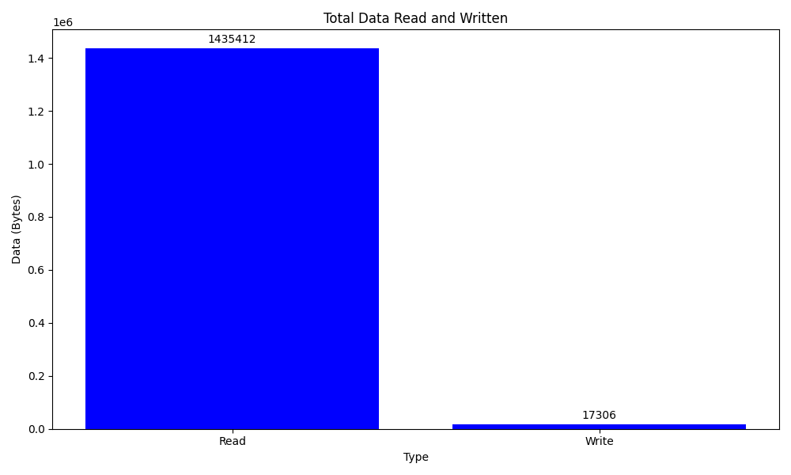
  - 标题：[Total Data Read and Written]由于figure1显示大量的syscall都有关于读写，因此就单独分析了读取与写入的涉及到的数据量。
  - 横坐标：读取与写入这两种操作类型
  - 纵坐标：数据量
  - 图像特征：
    - 可以观察到涉及到的读取的数据量远大于写入的，这是因为
      - 在编辑PPT的时候，程序需要读取整个PPT文件的内容，这包括所有的幻灯片、图像、文本、图表、媒体文件等，以便在编辑器中呈现给用户。这个过程可能涉及大量的数据读取操作。
      - 编辑软件可能会将PPT的数据缓存到内存中，以便进行快速访问和编辑。这意味着在实际保存文件之前，许多操作都只在内存中进行，而不需要频繁写入磁盘。
      - PPT文件（特别是现代的PPTX格式）通常包含很多元数据和结构信息，这些信息在文件加载时需要读取，但是在保存时可能没有太多变化，只需要更新具体修改的部分。（具体可以看后面解压缩文件的结构）
- FIGURE3
   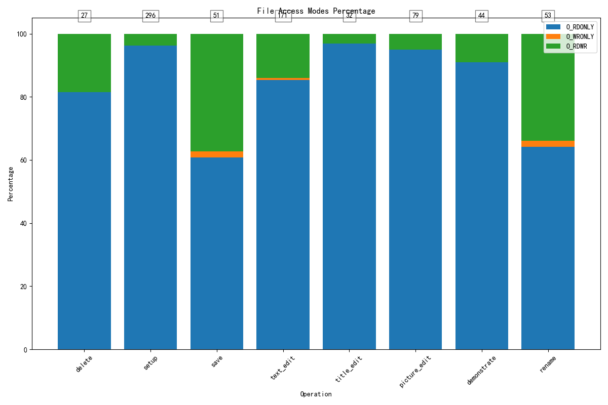
      	- 描述图的基本信息。比如标题，横纵坐标，图例
	- 详细解释这张图的特征
		- 为什么大体趋势是这样的（比如大部分都是读操作）
		- 为什么会出现异常点（如果有的话）
	- 标题：[File Acess Modes Percentage] 鉴于figure2中得出读取文件涉及的数据量远大于写入文件的数据量，我将不同的操作涉及到的文件打开方式做了分类。（借助openat）
	- 横坐标：操作类型
	- 纵坐标：不同打开方式的相对频率。每个条形图末端的数字表示在文件上涉及到的操作总次数。
	- 图像特征： 
	  - 可以看出不管是任何操作都是以O_RDONLY为主，极少的是以0_RDWR方式打开。 
- FIGURE3:
   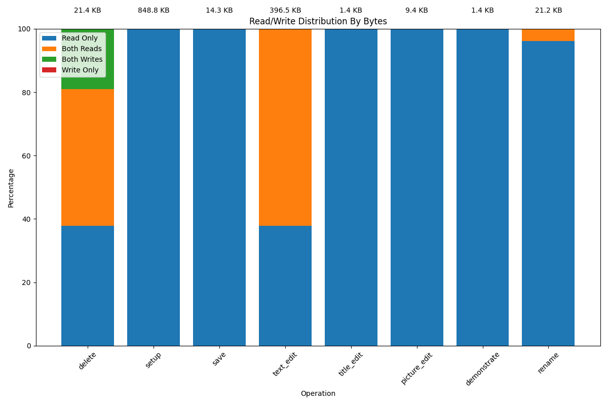
  - 标题：[Read/Write Distribution By Bytes]
  - 横坐标：操作类型
  - 纵坐标：不同打开方式的相对频率。每个条形图末端的数字表示在文件上涉及到的数据量总合
  - 图像特征：以仅读取方式打开的文件数据量占比最大，比较异常的是在save操作中，没有write only或者both read and writes 方式打开的文件。不知道是因为占比过少而无法可视化显示还是不涉及，我更偏向于前者，因为在save过程中调用了fsync。
- FIGURE4:
  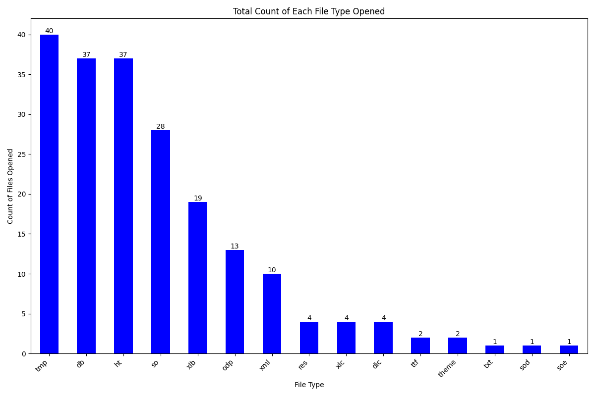
  - 标题：[Total Count of Each File Type Opened]在运行process_final.sh的过程中所涉及到的所有文件类型。
  - 横坐标是文件类型 
  - 纵坐标是这类文件被访问的总次数
  - 图像特征：
    - 涉及到许多的文件类型，而非只涉及到一直编辑的.odp 因此我解压了所创建的.odp文件：
      - 在解压缩的过程中如图：（当打开 .odp 文件时,应用程序会自动解压缩这个 ZIP 包,并识别其中的各个组成部分。）
       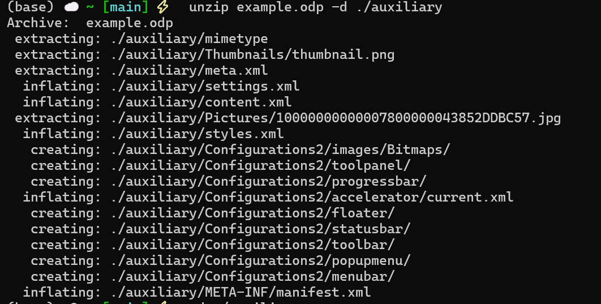 
        &nbsp;&nbsp;有一些文件涉及到解压缩，有的只需要直接提取，有的则需要创建目录，之所以会有这样的差异,是因为 .odp 文件的内部结构是有目的性的设计的:一些元数据和小型资源文件可以直接存储在压缩包中,无需解压缩，而主要的内容文件则需要解压缩才能被应用程序读取和使用。为了更好地管理这些文件,还需要创建相应的目录结构。
      - 这个是我解压出来的文件结构：
      - 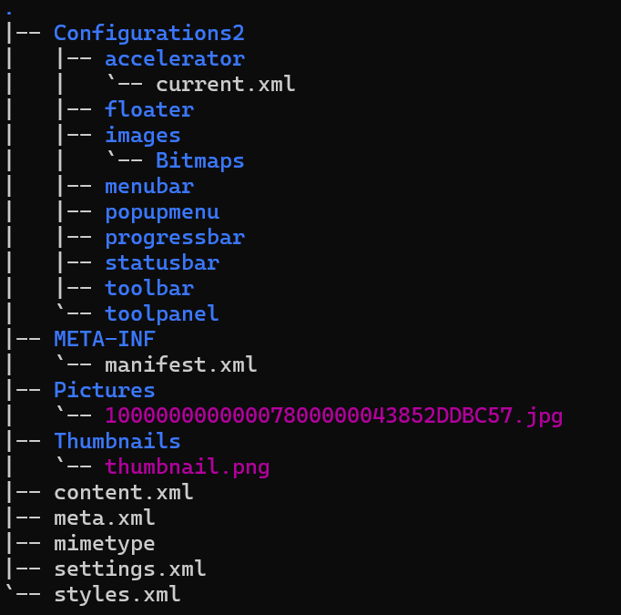
      - .odp 文件中包含的主要组件有:
        mimetype: 指示文件的媒体类型。
        Thumbnails: 包含文档的缩略图。
        meta.xml: 存储文档的元数据,如标题、作者、主题等。
        settings.xml: 保存文档的设置信息。
        content.xml: 存储文档的实际内容,如幻灯片、文本、图像等。
        styles.xml: 定义文档中使用的样式。
        Pictures: 包含文档中使用的图像文件。
        Configurations2: 存储应用程序特定的配置信息,如工具栏、菜单栏等的设置。
        META-INF/manifest.xml: 包含文档中所有组件的清单。
        这种结构使得 OpenDocument 格式具有很强的可扩展性和灵活性。比如在我修改.odp文件的时候，应用程序会自动跟踪我对各个子文件的操作，在保存的时候生成一个新的zip压缩包
    - 涉及到最多的文件类型是.tmp。原因是应用程序在执行复杂操作的时候会先把文件写入临时文件(.tmp)当完整的操作都实现了之后再把(.tmp)中的数据转移到最终的目标位置，一旦过程中出现任何错误和异常就可以直接丢弃这个临时文件，从而这样可以保证原子性原则，即不存在中间态。
- FIGURE4:
  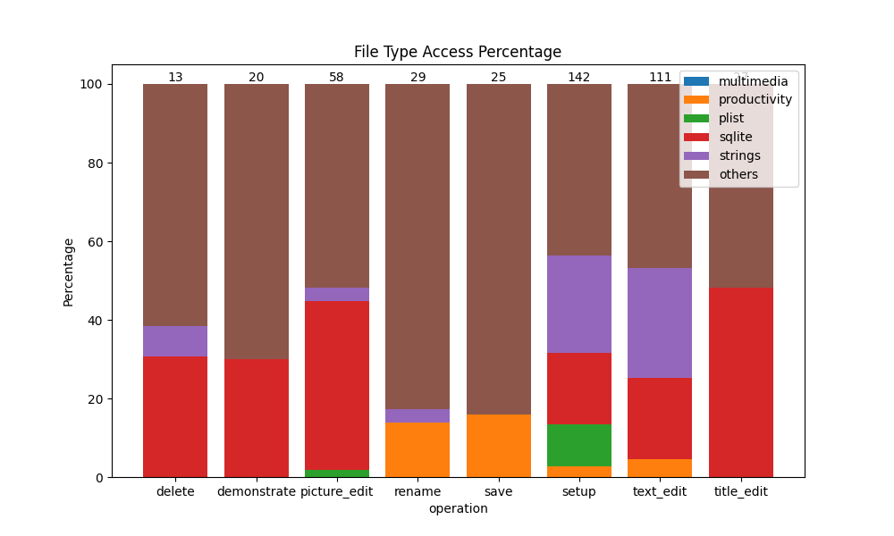
  - 标题：[File Type Access Percentage]我将figure3涉及到的文件类型按照论文中提到的分类方式进行了划分：
        "multimedia": [],
        "productivity": ['.txt', '.odt', '.odp', '.ttf'],
        "plist": ['.xml'],
        "sqlite": ['.db'],
        "strings": ['.dic', '.res', '.theme', '.xlb', '.xlc'],
        "others": ['.dat', '.aff', '.ht', '.tmp', '.log', '.so', '.sod', '.soe']
  - 横坐标：操作类型
  - 纵坐标：各种类型文件在一类操作里面的占比百分比
  - 此图显示了在不同文件类型上打开文件描述符的相对频率。每个条形图末端的数字表示在文件上打开的唯一文件描述符的总数
  - 图像特征：
    - sqlite类型的文件占比最多，others占比高的部分原因是我将.tmp归类到了others。

- FIGURE5:
   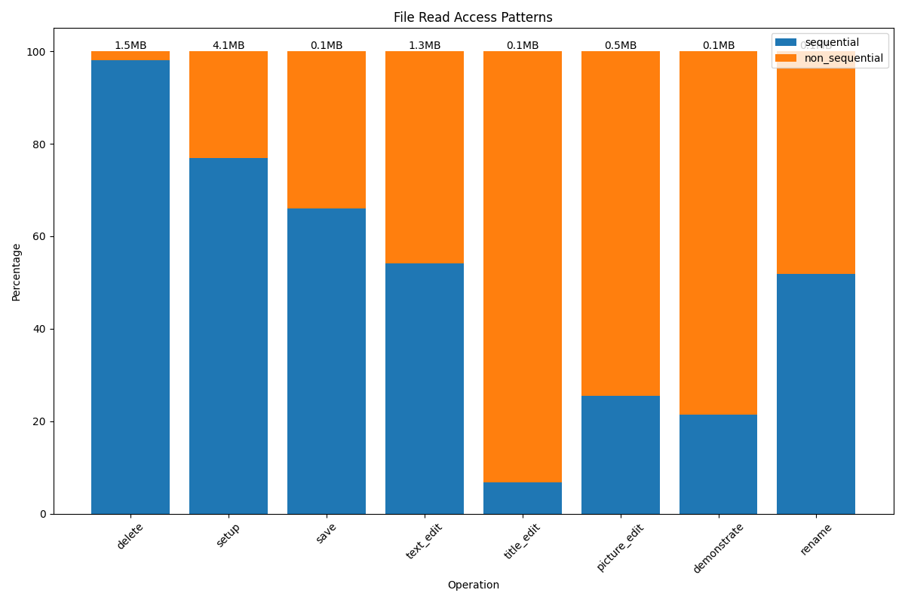 
   - 标题： [File Read Access Pattern] 
   - 横坐标：操作类型
   - 纵坐标：顺序访问和非顺序访问的数据量占比百分比。顶部数据是总访问的数据量。
   - 图像特征：
      - 从总体的数据量来看，以顺序读取数据为主，其中delete，setup，save，text_edit,rename操作都是顺序访问占比大于非顺序访问。 
      - title_edit表现了明显的非顺序访问为主。
        - 可能是因为在实现文件读写操作时选择的系统调用或API也会影响数据访问的顺序。例如，使用像pread或pwrite这类可以直接定位到文件任意位置的系统调用，会增加非顺序访问的发生。
        - 此外由于解压.odp文件获得了许多小文件，有可能因为文件的分配可能不是连续的，这会增加非顺序访问的情况。
        - 值得注意的是：原论文当中还引入了nearly-sequential的概念，当至少95%的字节读取或写入文件顺序运行时，作者将对文件的访问定义为“nearly-sequential”，但是我的图表里面没有进行这一步的划分，所以可能会导致大部分nearly-sequential被划分成non-sequential。
   - 
- FIGURE6:
   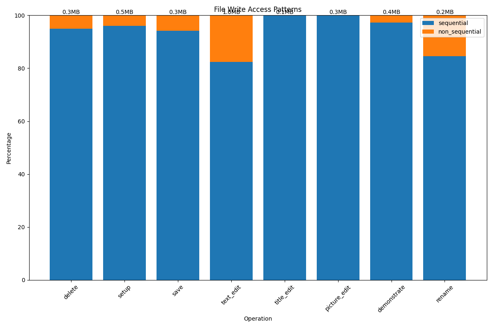 
   - 标题： [File Write Access Pattern] 
   - 横坐标：操作类型
   - 纵坐标：顺序访问和非顺序访问的数据量占比百分比。顶部数据是总访问的数据量。
   - 图像特征： 
     - 以顺序写入的方式为主，占比几乎都超过百分之八十，绝大多数都超过百分之九十。
     - 综合figure8与figure9，得出结论：大量的任务包含单纯的顺序访问。
- FIGURE7:
   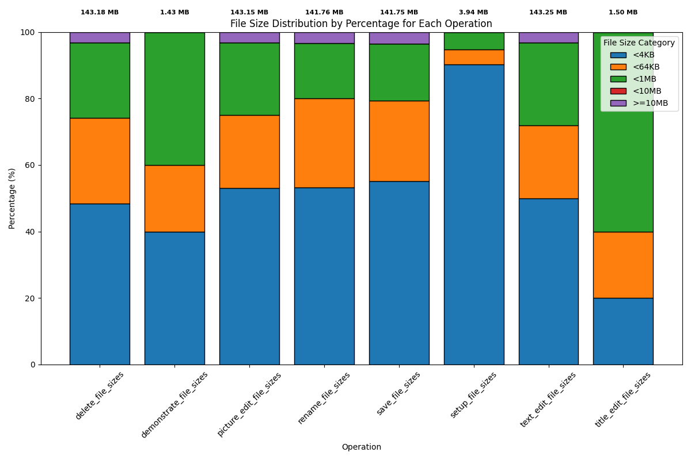 
   - 标题： [File Size Distribution by Percentage for Each File] 
   - 横坐标：操作类型
   - 纵坐标：百分比
   - 图例：文件大小
   - 图像特征：
     - 此图显示了访问结束时每个大小范围的访问文件中的字节部分。文件大小的总和将出现在条形图的末尾。这个数字与总文件占用空间不同，因为文件的大小会随时间变化，并且重复访问的文件会被计算多次。   
     - 访问小文件的比例非常高。由figure4我们观察到对于sqlite类型的文件访问量很大，而正是是由于频繁使用存储首选项、设置和其他应用程序数据的.plist文件；这些文件通常只填充一到两个4 KB的页面。
- FIGURE8:
   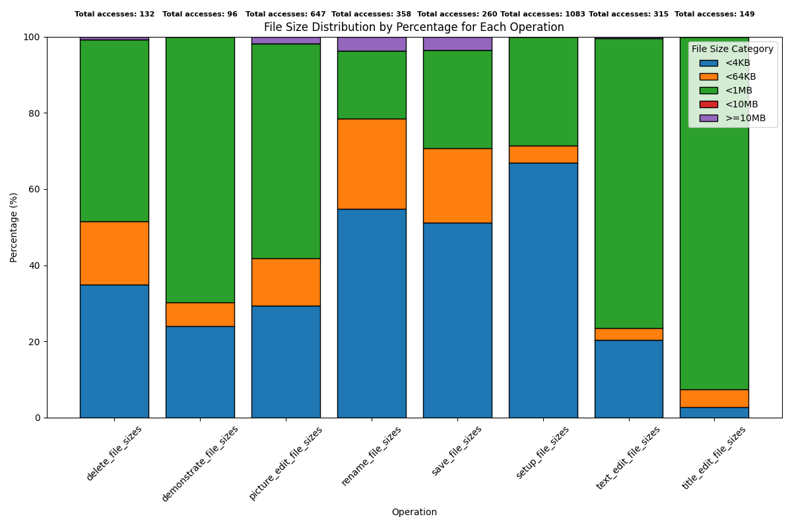 
   - 标题： [File Write Access Pattern] 
   - 横坐标：操作类型
   - 纵坐标：百分比
   - 图例：文件大小
   - 图像特征：
     - 此图显示了访问结束时每个文件大小范围内访问的文件数量。文件访问的总数显示在条形图的末尾。请注意，重复访问的文件会计算多次，即使在部分文件访问时也会计算整个文件大小。
     - 数据量很大的文件主导着每个启动工作负载和几乎所有处理多媒体文件的任务。小文件占少数字节，而非常小的文件基本上可以忽略不计。

**整体结论**
  &nbsp;&nbsp;通过对OpenOffice 4.1.15在不同操作过程中所产生的系统调用（syscalls）的详细分析，我们能够验证和扩展《A File is Not a File: Understanding the I/O Behavior of Apple Desktop Applications》中的一些主要结论。具体分析和结论如下：
  1. A file is not a file
  在编辑一个PPT的过程中，涉及的文件类型不仅限于正在编辑的.odp文件。还包括各种辅助文件，如临时文件（.tmp），元数据文件（.xml），以及配置文件等。这表明实际I/O操作涉及到多个文件，并不仅仅是用户认为的单个PPT文件。
  1. Sequential access is not sequential
  图表显示，在大多数操作中，尤其是标题编辑（title_edit）过程中，存在明显的非顺序读取（non-sequential read）行为。这可能是由于在文件编辑过程中需要随机访问文件的不同部分来读取或写入数据。
  1. Auxiliary files dominate
  分析表明，临时文件（.tmp）在整个PPT制作过程中占据了显著的份额。这些辅助文件在确保数据的一致性和原子性操作中发挥了重要作用。
  1. Writes are often forced; renaming is popular
  频繁的rename操作被观察到，特别是在setup、delete、edit、rename这些操作中。这些操作确保了文件操作的原子性，避免了因系统崩溃或电源故障而导致的数据不一致问题。此外，虽然在save操作中有fsync调用，但在其他操作中几乎没有观察到fsync，这表明文件写入操作往往依赖于重命名来确保数据的持久性和一致性。
